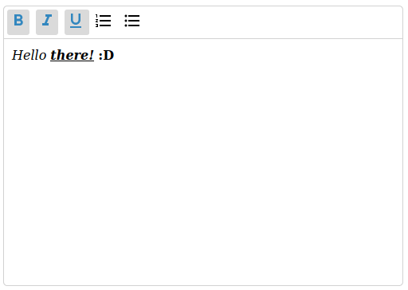

# text-editor-wc
## What is this?
A webcomponent to implement a text editor with default text formatting.

This web component is developed with native javascript and will be extended with further functions for formatting.

## Currently planned and in development for formatting: 
- bold
- italic
- underlined
- ordered list
- unordered list
  
## status
The web component is just in development and need some time for finishing and testing.
After the release, the web compoment will be reveiving further functions