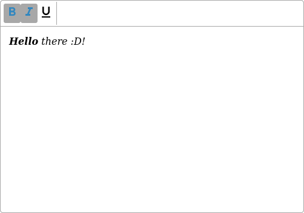

# text-editor-wc
## What is this?
A webcomponent to implement a text editor with default text formatting into your project! 

This editor is developed with the javascript APIs **Selection** and **Range**, due to the function **execCommand** is obsolet. 
Most usecases are considered, but further there are same cases not yet covered. 
## Formatting-features
- bold
- italic
- underlined

## Support
Currently, the webcomponent only support Firefox. A full support for Chrome at this time isn't planned.

